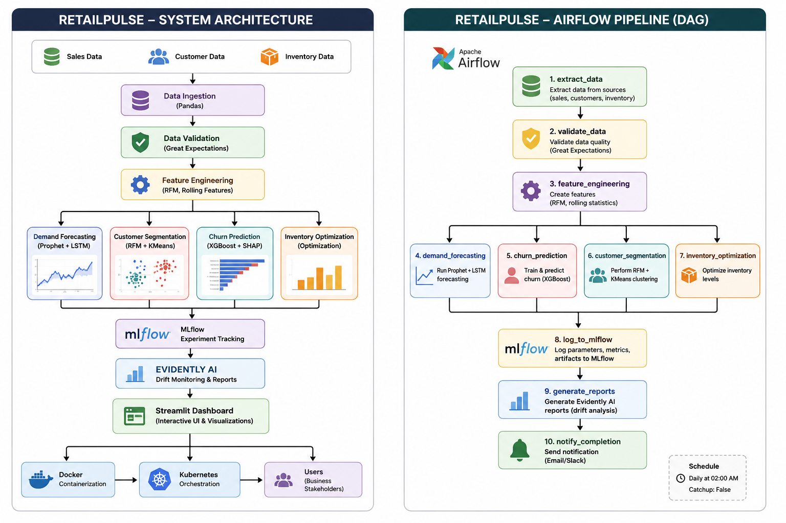

# 📊 RetailPulse – AI-Powered Customer Analytics & Demand Forecasting Platform

> Predictive Demand • Customer Segmentation • Churn Analysis • Inventory Optimization



## 🌐 Live Demo

🔗 https://airetailpulse.streamlit.app

---

## 📌 Project Overview

RetailPulse is an end-to-end AI-powered retail analytics platform designed to help businesses optimize demand forecasting, customer retention, and inventory management using machine learning and advanced analytics.

The platform integrates forecasting, customer segmentation, churn prediction, inventory optimization, monitoring, and MLOps practices into a single interactive dashboard.

This project was developed as part of the **Zidio Development Data Science & Analytics Program (March 2026 Edition).** :contentReference[oaicite:0]{index=0}

---

## 🎯 Business Objectives

Retail businesses lose billions due to poor forecasting and inefficient inventory management. RetailPulse addresses these challenges by delivering actionable insights through AI and analytics. :contentReference[oaicite:1]{index=1}

### Expected Business Impact

- 📉 Reduce stockouts by **30–50%**
- 📈 Increase revenue by **15–25%**
- 🔄 Improve customer retention through churn prediction
- ⚡ Process large-scale retail transactions efficiently
- 📦 Optimize inventory replenishment decisions :contentReference[oaicite:2]{index=2}

---

# ✨ Key Features

| ID | Feature | Description | Acceptance Criteria |
|----|----------|-------------|---------------------|
| F-01 | Data Ingestion & Cleaning | Automated ETL and data validation | Great Expectations checks |
| F-02 | Customer Segmentation | RFM + K-Means clustering | 6 meaningful customer segments |
| F-03 | Demand Forecasting | Hybrid Prophet + LSTM forecasting | MAPE ≤ 12% |
| F-04 | Churn Prediction | XGBoost + SHAP explainability | AUC ≥ 0.88 |
| F-05 | Inventory Optimization | Reorder recommendations | Reduced stock inefficiencies |
| F-06 | Interactive Dashboard | Streamlit multi-page analytics | Real-time visual insights | :contentReference[oaicite:3]{index=3}

---

# 🛠 Technology Stack

| Category | Technology |
|-----------|-------------|
| Programming Language | Python 3.11 |
| Data Processing | Pandas, NumPy |
| Machine Learning | Scikit-Learn, XGBoost |
| Forecasting | Prophet + LSTM (PyTorch) |
| Dashboard | Streamlit |
| Experiment Tracking | MLflow |
| Data Validation | Great Expectations |
| Drift Monitoring | Evidently AI |
| Workflow Automation | Apache Airflow |
| Deployment | Docker |
| Orchestration | Kubernetes |
| Monitoring | Prometheus + Grafana |
| CI/CD | GitHub Actions | :contentReference[oaicite:4]{index=4}

---

# 🏗 System Architecture


### Data Flow

```text
Sales Data + Customer Data + Inventory Data
                    ↓
             Data Ingestion
                    ↓
      Great Expectations Validation
                    ↓
          Feature Engineering
                    ↓
 ┌───────────┬───────────┬────────────┐
 │           │           │            │
Forecast   Churn    Segmentation  Inventory
 │           │           │            │
 └───────────┴───────────┴────────────┘
                    ↓
                 MLflow
                    ↓
              Evidently AI
                    ↓
          Streamlit Dashboard
                    ↓
         Docker → Kubernetes